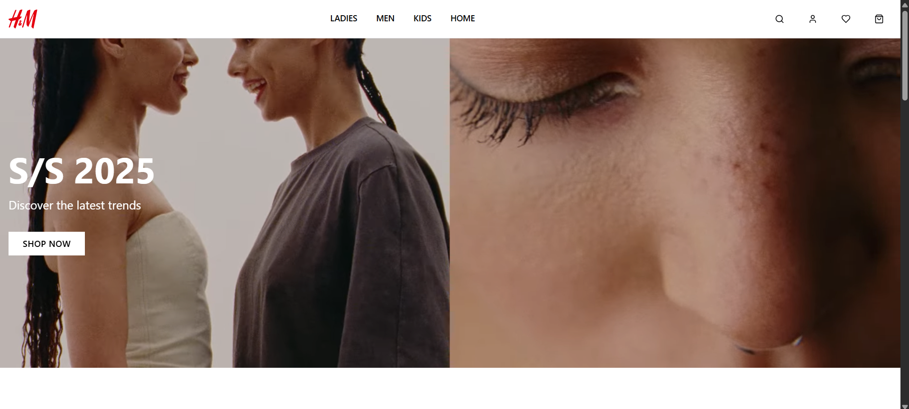
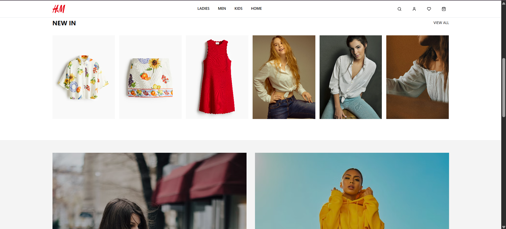
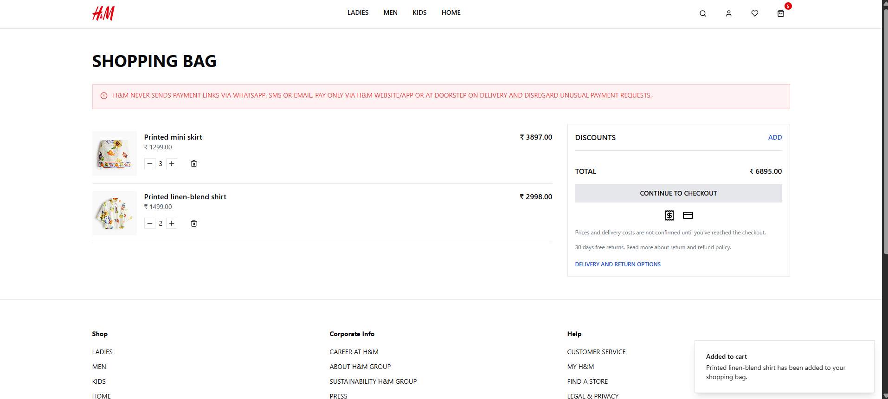
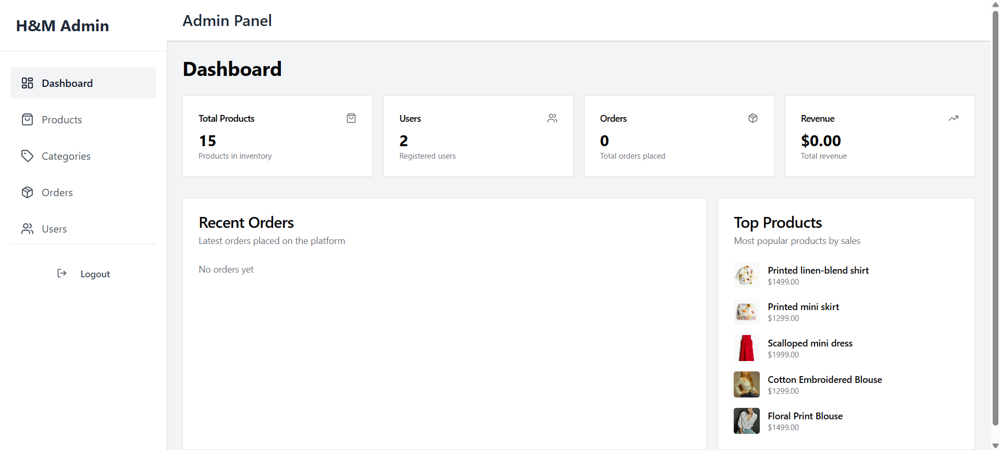
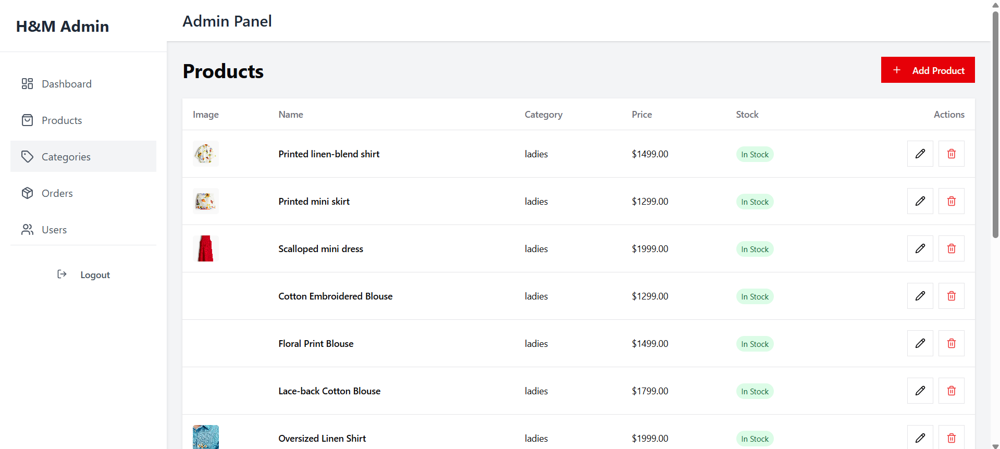

# HnMfashion Clone

`https://www2.hm.com/en_in/index.html`

## Project Overview

HnMfashion is a web application built using React and Express. It provides a platform for users to explore fashion products and manage their shopping experience.

## Installation

To set up the project locally, follow these steps:

1. Clone the repository:

   ```bash
   git clone https://github.com/gurr-i/H-M-Online--Fashion.git
   ```
2. Navigate to the project directory:

   ```bash
   cd HnMfashion
   ```
3. Install the dependencies:

   ```bash
   npm install
   ```

## Usage

To start the development server, run:

```bash
npm run dev
```

To build the project for production, use:

```bash
npm run build
```

To start the production server, execute:

```bash
npm run start
```

## Features

- Browse fashion products
- User authentication
- Shopping cart management

## Contribution

Contributions are welcome! Please fork the repository and submit a pull request.

## License

This project is licensed under the MIT License.

## Screenshots









Admin





## GitHub Repository

Access the project's source code and contribute via the GitHub repository:

[HnMfashion GitHub Repository](https://github.com/gurr-i/H-M-Online--Fashion)
